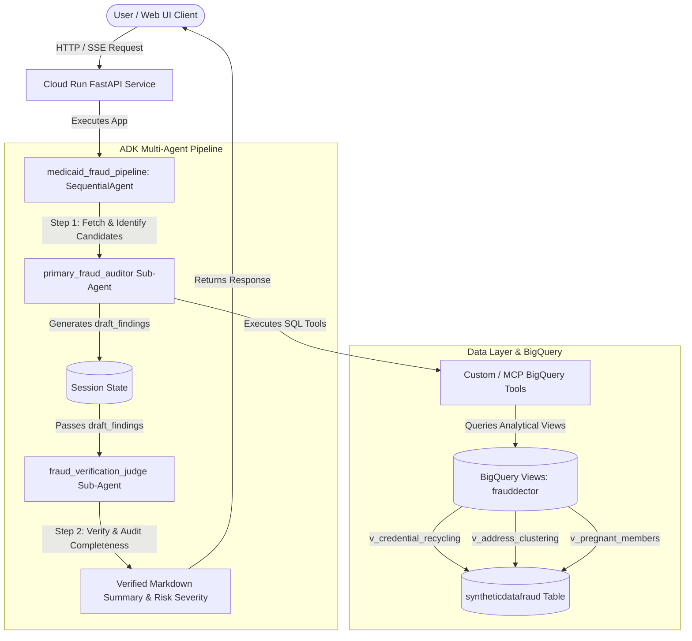

# Medicaid Application Auditor - Architecture & Agent Overview

> **DISCLAIMER:** This project is provided solely as an illustrative sample and proof-of-concept for educational and demonstration purposes. This is **NOT** an official Google product or officially supported Google software. It is provided "as is" without warranty or guarantee of any kind.

---

## 1. System Architecture Diagram

---

## 2. Agent & Sub-Agent Breakdown

### A. Orchestrator: `medicaid_fraud_pipeline` (`SequentialAgent`)
- **Type**: ADK `SequentialAgent`
- **Role**: Coordinates deterministic multi-stage execution without requiring an LLM router to guess step ordering.
- **Workflow**:
  1. Invokes `primary_fraud_auditor` to query data and compile candidate records.
  2. Passes candidate records directly to `fraud_verification_judge` for validation and risk scoring.

---

### B. Sub-Agent 1: `primary_fraud_auditor` (`Agent`)
- **Model**: `gemini-3.7-flash`
- **Output Key**: `draft_findings`
- **Role**: Data Extraction & Initial Pattern Detection
- **Responsibilities**:
  - Translates user requests into targeted SQL queries against BigQuery.
  - Detects raw candidate matches across the 5 core fraud rules.
  - Batches large result sets (10–15 rows at a time) to avoid memory or context bloat.
  - Formats initial findings as structured Markdown candidate tables.

---

### C. Sub-Agent 2: `fraud_verification_judge` (`Agent`)
- **Model**: `gemini-3.7-flash`
- **Input**: `{draft_findings}`
- **Role**: Quality Assurance, False-Positive Filtering & Compliance Verification
- **Responsibilities**:
  - Audits candidate records from `primary_fraud_auditor` for 100% compliance against rule criteria.
  - Double-checks cross-row matches (e.g., ensuring address clusters have >2 distinct case numbers).
  - Verifies that no matching records or edge cases were skipped.
  - Assigns a **Risk Severity** classification to each flagged submission:
    - **CRITICAL**: Cross-case Credential Recycling or multi-case Address Clusters (>5 cases).
    - **HIGH**: Address Clusters (3–5 cases) or Pregnant Member anomalies.
    - **MEDIUM**: Identity Mismatch or Sequential Cluster anomalies.

---

## 3. Data Connectors & BigQuery Integration

### A. Custom BigQuery Tools / MCP Integration
- **`query_syntheticdatafraud`**: Direct Python tool wrapper querying BigQuery dataset `<PROJECT_ID>.<DATASET>.<TABLE>`. Supports `credential_recycling`, `address_clustering`, `pregnant_members`, `all`, and `custom` WHERE clauses.
- **`execute_bigquery_sql`**: Allows ad-hoc custom SQL queries for complex fraud pattern inspection.

### B. Pre-Computed BigQuery Analytical Views
To optimize query response times and avoid repeated full-table scans, the data layer utilizes pre-computed BigQuery views:
1. `v_credential_recycling`: Filters duplicate `USERNAME` and `PASSWORD` values shared across distinct `NUM_CASE`.
2. `v_address_clustering`: Isolates `ADR_STREET_1` addresses associated with >2 distinct Medicaid cases.
3. `v_pregnant_members`: Groups members with `CDE_CAT_REL = 'CNF'` sharing first names and birth years.

---

## 4. Summary Table of System Components

| Component Name | Type | Model / Tech | Main Responsibility |
| :--- | :--- | :--- | :--- |
| `medicaid_fraud_pipeline` | `SequentialAgent` | ADK Pipeline | Pipeline orchestration across auditor and judge stages. |
| `primary_fraud_auditor` | `Agent` | `gemini-3.7-flash` | Runs BigQuery queries and compiles initial candidate matches. |
| `fraud_verification_judge` | `Agent` | `gemini-3.7-flash` | Double-checks findings, eliminates false positives, and assigns risk severity. |
| `query_syntheticdatafraud` | Tool | BigQuery Python SDK | Connects to BigQuery and executes optimized detection queries. |
| `execute_bigquery_sql` | Tool | BigQuery Python SDK | Executes ad-hoc query analysis against target BigQuery dataset. |
| `syntheticdatafraud` | Data Table | BigQuery Table | Source dataset containing Medicaid application extracts. |
