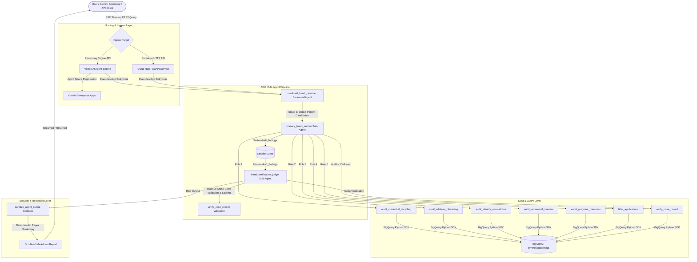

# Medicaid Application Auditor - Architecture & Agent Overview

> **DISCLAIMER:** This project is provided solely as an illustrative sample and proof-of-concept for educational and demonstration purposes. This is **NOT** an official Google product or officially supported Google software. It is provided "as is" without warranty or guarantee of any kind.

---

## 1. System Architecture Diagram

---

## 2. Multi-Agent Pipeline Breakdown

### A. Orchestrator: `medicaid_fraud_pipeline` (`SequentialAgent`)
- **Type**: Google ADK `SequentialAgent`
- **Role**: Deterministic multi-stage workflow coordinator ensuring strict ordering between discovery and verification without relying on probabilistic LLM routing.
- **Workflow**:
  1. Invokes `primary_fraud_auditor` to query BigQuery and write initial candidate records into session state under `draft_findings`.
  2. Passes `draft_findings` directly into `fraud_verification_judge` for independent validation, false-positive filtering, and risk scoring.
  3. Triggers the `after_agent_callback` (`sanitize_agent_output`) to deterministically scrub internal infrastructure references before output delivery.

---

### B. Stage 1: `primary_fraud_auditor` (`Agent`)
- **Model**: `gemini-3.7-flash` (or `gemini-2.5-flash`)
- **Output Key**: `draft_findings`
- **Role**: Pattern Detection & Data Extraction
- **Responsibilities**:
  - Analyzes user inquiries and invokes the appropriate specialized audit tool corresponding to the 5 core Medicaid fraud rules.
  - Batches and formats candidate records into structured Markdown tables containing case numbers, applicant demographics, usernames, addresses, and masked password hashes.
  - Formats output systematically with demographic cluster breakdowns and applicant metadata.
- **Assigned Tools**:
  - `audit_credential_recycling` (Rule 1: Shared usernames/passwords across distinct case numbers)
  - `audit_address_clustering` (Rule 2: High-density address clusters sharing identical street lines)
  - `audit_identity_mismatches` (Rule 3: Applicant names differing from account/email identities)
  - `audit_sequential_clusters` (Rule 4: Time-correlated sequential logon/creation activity)
  - `audit_pregnant_members` (Rule 5: Pregnant members `CNF` sharing first names and birth years)
  - `filter_applications` (Dynamic parameter filtering across case numbers, cities, and categories)

---

### C. Stage 2: `fraud_verification_judge` (`Agent`)
- **Model**: `gemini-3.7-flash`
- **Input Context**: `{draft_findings}`
- **Role**: Senior Fraud Investigator & Compliance Quality Assurance
- **Responsibilities**:
  - Evaluates every candidate record in `{draft_findings}` against explicit fraud definitions to eliminate false positives.
  - Calls `verify_case_record` to verify individual case legitimacy and calculate exact collision metrics:
    - Independent count of other cases sharing the same username.
    - Independent count of other cases sharing the same street address.
  - Verifies that cross-case anomalies have $\ge 2$ distinct case numbers.
  - Assigns an objective **Risk Severity** classification:
    - **CRITICAL**: Cross-case credential recycling or multi-case address clusters ($\ge 4$ cases).
    - **HIGH**: Small address clusters (2–3 cases) or pregnant member anomalies sharing identical birth years.
    - **MEDIUM**: First-party identity/name mismatches without shared credentials or addresses.
    - **LOW**: Minor anomalies with no detected cross-account collisions.
- **Assigned Tools**:
  - `verify_case_record`

---

## 3. Data Connectors & BigQuery Integration

The data layer connects directly to BigQuery via the `google-cloud-bigquery` Python SDK using ADC or IAM service account credentials.

### Specialized Audit Query Architecture
Each audit tool executes targeted, parameterized SQL with analytical window functions and aggregations directly against the target table (`<PROJECT_ID>.<DATASET>.<TABLE>`):

1. **`audit_credential_recycling`**:
   - Uses `COUNT(DISTINCT NUM_CASE) OVER(PARTITION BY LOWER(TRIM(USERNAME)))` and `COUNT(DISTINCT NUM_CASE) OVER(PARTITION BY PASSWORD)` to surface shared credentials across distinct case numbers.
2. **`audit_address_clustering`**:
   - Groups by normalized street address (`LOWER(TRIM(ADR_STREET_1))`) with `HAVING COUNT(DISTINCT NUM_CASE) >= 2` to detect cross-case physical address rings.
3. **`audit_identity_mismatches`**:
   - Compares normalized `NAM_FIRST` against prefixes of `USERNAME` and `EMAIL_ADDRESS` to isolate potential synthetic or hijacked identities.
4. **`audit_sequential_clusters`**:
   - Evaluates same-day logon batches (`DTE_LAST_LOGON`) across sequential case numbers or adjacent records.
5. **`audit_pregnant_members`**:
   - Filters `CDE_CAT_REL = 'CNF'`, grouping by normalized `NAM_FIRST` and birth year (`SUBSTR(CAST(DTE_BIRTH AS STRING), 1, 4)`) where `COUNT(DISTINCT NUM_CASE) >= 2`.
6. **`verify_case_record`**:
   - Fetches full record metadata for a single `case_number` and executes sub-queries calculating shared username and address collision counts.

---

## 4. Hosting, Ingress & Platform Integration

The agent supports dual deployment targets:

### A. Vertex AI Agent Engine (`reasoningEngines`)
- **Primary Serverless Target**: Managed runtime with zero infrastructure maintenance.
- **Adapter**: Includes native REST/SSE HTTP streaming adapter (`streaming_agent_run_with_events`) for direct integration with enterprise frontends and Gemini Enterprise.
- **Agent Registry / Gemini Enterprise**: Registered directly into enterprise Agent Spaces (`frauddectorapp_1787760680542`, `agentspace-adk_1749611082035`) via `scripts/publish_ge.py`.

### B. Google Cloud Run
- **Container Target**: Packaged via Dockerfile with FastAPI and Uvicorn.
- **Endpoints**:
  - `POST /run_agent`: Synchronous JSON execution.
  - `POST /run_agent_stream`: Server-Sent Events (SSE) streaming tokens.
  - `GET /healthz`: Container liveness check.

---

## 5. Security, Redaction & Privacy Layer

To comply with enterprise security and data loss prevention (DLP) standards:
- **Password Masking**: All password hashes are masked (`***[<hash-suffix>]`) in SQL queries before entering agent memory.
- **Infrastructure Redaction Post-Processor**:
  - The `sanitize_agent_output` callback uses regex pattern matching (`REDACTION_REGEX`) to deterministically scrub internal GCP project IDs, BigQuery dataset names, table paths, and environment specifics from both session state and final LLM output tokens before returning to the user.

---

## 6. Summary of System Components

| Component Name | Type | Model / Tech | Main Responsibility |
| :--- | :--- | :--- | :--- |
| `medicaid_fraud_pipeline` | `SequentialAgent` | Google ADK | Deterministic pipeline orchestration across detection and verification stages. |
| `primary_fraud_auditor` | `Agent` | `gemini-3.7-flash` | Executes BigQuery audit tools and compiles initial candidate match tables. |
| `fraud_verification_judge` | `Agent` | `gemini-3.7-flash` | Performs cross-case verification, eliminates false positives, and assigns risk scores. |
| `audit_credential_recycling` | Tool | BigQuery SQL | Identifies recycled usernames and passwords across distinct case numbers. |
| `audit_address_clustering` | Tool | BigQuery SQL | Identifies high-density physical address clusters across distinct case numbers. |
| `audit_identity_mismatches` | Tool | BigQuery SQL | Flags mismatches between applicant first names and username/email handles. |
| `audit_sequential_clusters` | Tool | BigQuery SQL | Discovers time-correlated application bursts across sequential case IDs. |
| `audit_pregnant_members` | Tool | BigQuery SQL | Surfaces pregnant members (`CNF`) sharing identical first names and birth years. |
| `verify_case_record` | Tool | BigQuery SQL | Evaluates single case metadata and calculates cross-case collision metrics. |
| `sanitize_agent_output` | Callback | Python / Regex | Deterministically redacts infrastructure identifiers and sensitive metadata. |
| `syntheticdatafraud` | Data Table | BigQuery Table | Source dataset containing Medicaid application extracts. |
| Vertex AI Agent Engine | Managed Platform | `reasoningEngines` | Scalable cloud execution runtime integrated with Gemini Enterprise. |
